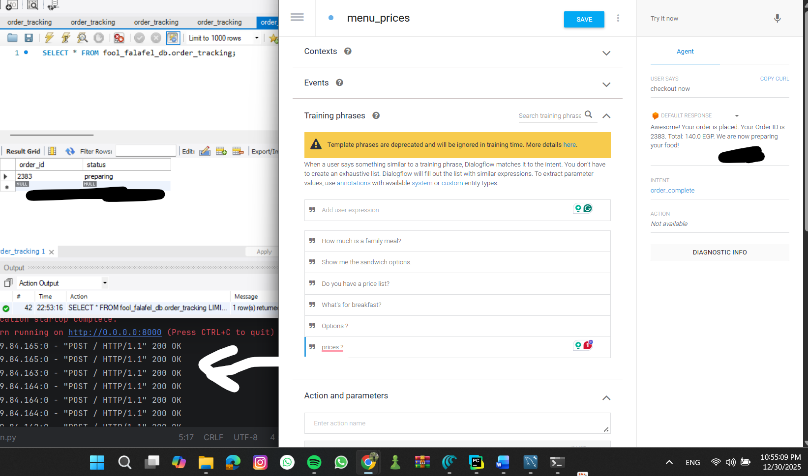

## Foul & Falafel - End-to-End NLP Chatbot
An automated conversational AI chatbot built to handle food orders and real-time order tracking for a traditional Middle Eastern eatery. This project integrates Natural Language Understanding (NLU) with a robust Python backend and a relational MySQL database.

## Features

Natural Language Ordering: Users can add or remove items using conversational phrases (e.g., "I want two fava bean sandwiches and one falafel").

Cart Management: Maintains a virtual cart during the session, allowing users to modify quantities before finalizing.

Order Tracking: Generates unique Order IDs and provides real-time status updates (Preparing, In Transit, Delivered).

Menu & Info Inquiry: Provides up-to-date pricing and restaurant opening hours.



## Tech Stack

NLP/NLU: Google Dialogflow (ES)

Backend: Python 3.x, FastAPI

Database: MySQL 8.0

Tunneling: ngrok (for local development webhook)

Server: Uvicorn

## Project Structure

```
├── main.py             # FastAPI router and Dialogflow intent handlers
├── db_handler.py       # Modular database operations and connection logic
├── fool_falafel_db.sql # MySQL schema, stored procedures, and tracking logic
├── requirements.txt    # Project dependencies
└── README.md           # Project documentation
```
Installation & Setup
1. Database Setup
Open MySQL Workbench.

Execute the fool_falafel_db.sql script to create the database, tables, and stored procedures (e.g., insert_order_item).

2. Backend Setup
Clone the repository and install dependencies:

```
pip install -r requirements.txt
```
Update the config dictionary in db_handler.py with your MySQL user and password.

Start the server:
```
python main.py
```
3. Webhook Tunneling
To allow Dialogflow to talk to your local server, run ngrok:

```
ngrok http 8000
```
Copy the https Forwarding URL provided by ngrok and paste it into the Fulfillment section of your Dialogflow Console.

## NLP Logic

The bot uses a combination of Intents and Entities:

Intents: add_item, remove_item, view_cart, track-order, order_complete, New-order.

Entities: @food-item (mapping synonyms like "tameya" or "fava beans" to their reference values) and @sys.number for quantities and IDs.

Key Learnings
Session Handling: Managing state in a stateless HTTP environment by mapping unique session strings to numeric IDs.

Database Optimization: Using SQL Stored Procedures and Functions to handle business logic inside the database for better performance and security.

NLU Accuracy: Training an agent with synonyms to handle various ways customers name traditional foods.
